# 前端设计流程

> 一套利用 AI 工具快速搭建落地页的工作流：从找灵感、剥背景、做动态、搭首屏，到完善页面、替换素材、润色文案。

---

## 一、灵感搜集 — Pinterest 找参考

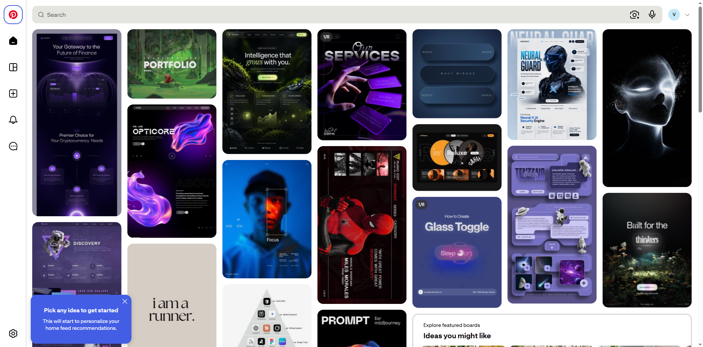

打开 Pinterest 网站浏览设计灵感，找到让你心动的页面。这一步不用想太多，纯逛、纯收集。

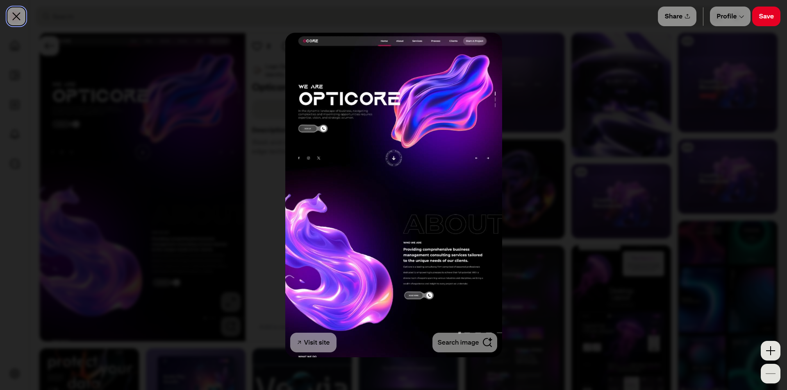

找到满意的图之后，直接截图——注意只截页面内容本身，不要把浏览器边框、标签栏等多余元素截进去。

---

## 二、背景剥离 — AI 提取纯净背景

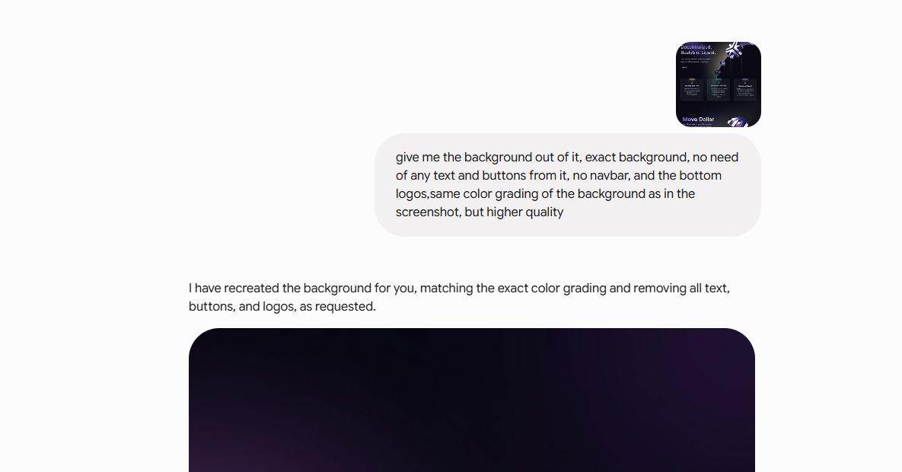

把截好的图丢给 AI，用以下提示词让它把背景单独剥离出来：

```
give me the background out of it, exact background, no need of any text and buttons from it, no navbar, and the bottom logos,same color grading of the background as in the 
screenshot, but higher quality
```

核心思路：让 AI 去掉文字、按钮、导航栏、底部 logo，只保留纯背景，保持原图的色调，但输出更高清的版本。

---

## 三、动态背景 — Kling AI 让背景动起来

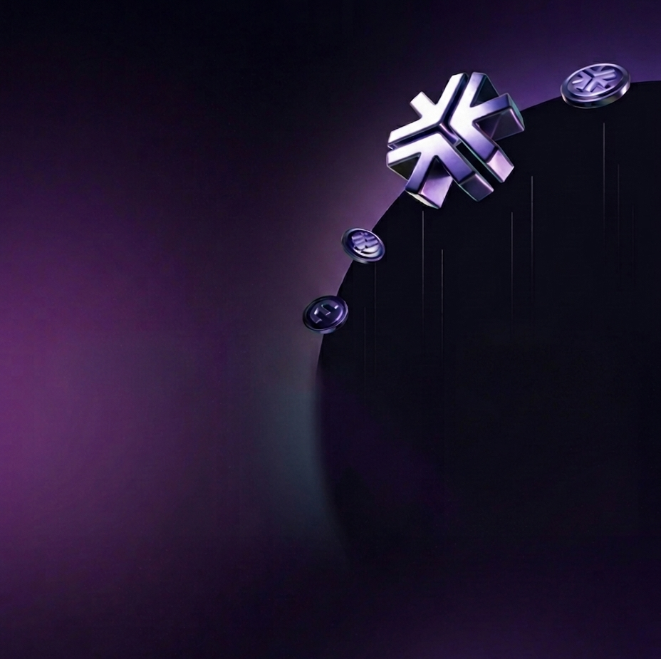

拿到静态背景图之后，用 Kling AI 为它增添动态效果。一个会动的首屏背景比静态图有质感得多，用户第一眼的视觉冲击力就靠这一步。

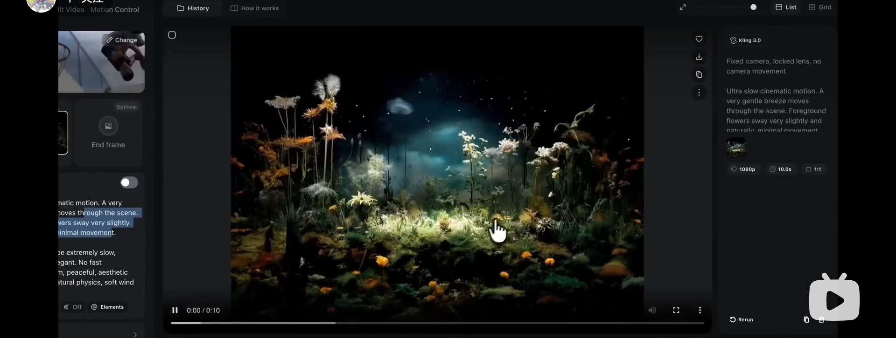

生成后的视频可以上传到 Mux 托管平台，获得一个可以直接嵌入网页的视频链接。

---

## 四、首屏搭建 — motionsites.ai + Lovable 快速出 UI

去 motionsites.ai 平台浏览各种首屏设计，看到喜欢的 UI 直接复制过来。

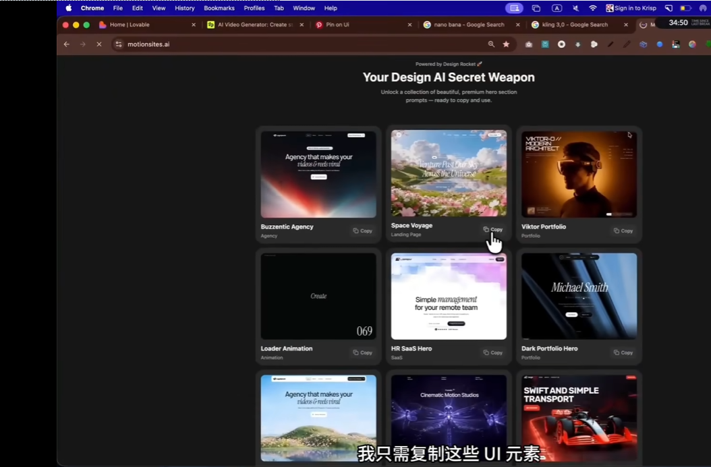

然后打开 Lovable 网站：

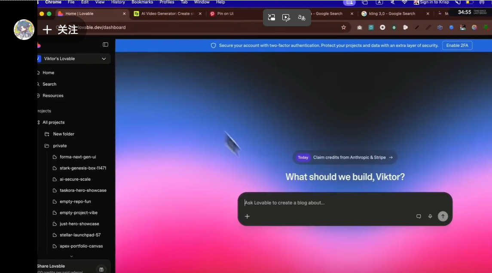

把刚才复制的 UI 设计直接粘贴进去，Lovable 会帮你生成一模一样的界面。

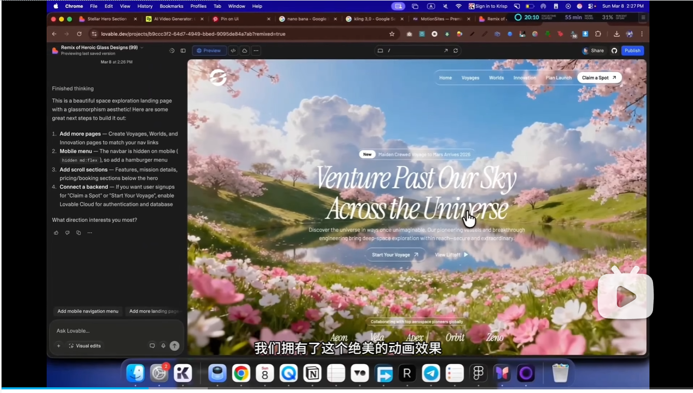

生成出来的首屏代码里，视频/背景部分目前还是示例内容。接下来只需要找到代码中对应的位置：

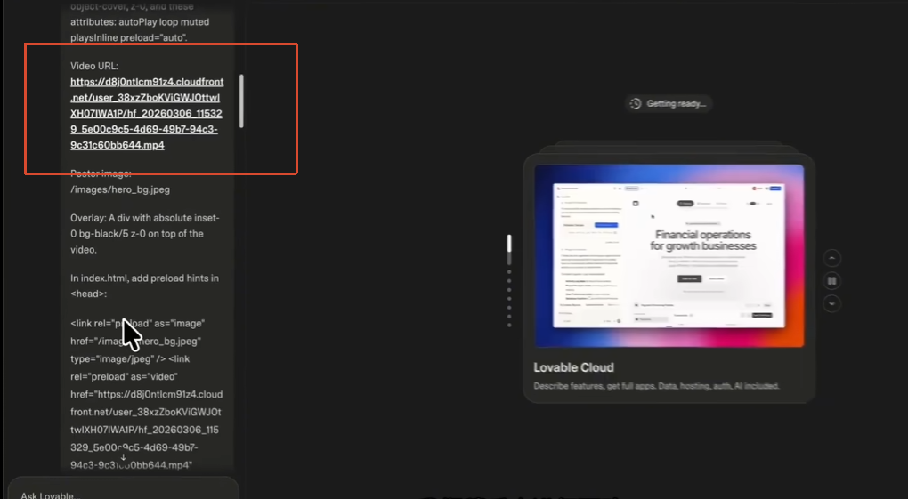

用我们自己在第三步生成的视频链接（托管在 Mux 上的那个）替换掉即可。

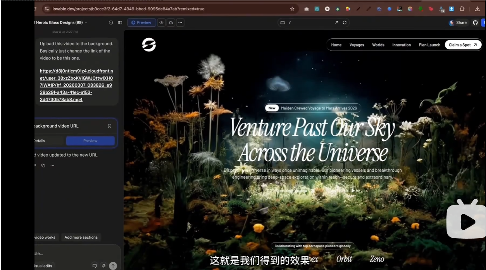

---

## 五、完善落地页 — 详细提示词驱动剩余部分构建

首屏搞定之后，继续搭建落地页的其余区块。

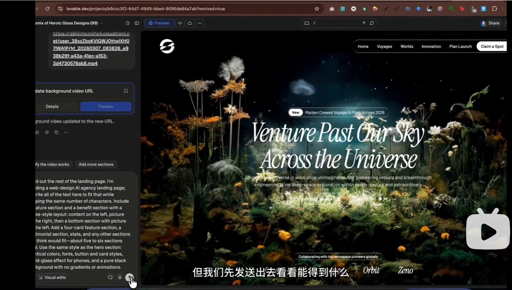

这一步的关键是**提示词要无比详尽**——仔细描述清楚你要设计什么内容、每个区块的空间位置分布。提示词中必须包含以下要素：

> - 明确说明「正在构建落地页的剩余部分」
> - 讲清楚这是什么主题的落地页
> - 要求重写上面所有的文本以适应这个主题，但要**保证相同的字符数**（这一步可以防止破坏现有布局结构）
> - 列出你需要哪些区块（如特性展示、案例、CTA 等）
> - 指定采用什么风格
> - 说明内容放哪里、图片放哪里
> - 强调沿用首屏已经创建好的相同风格（字体、配色等）

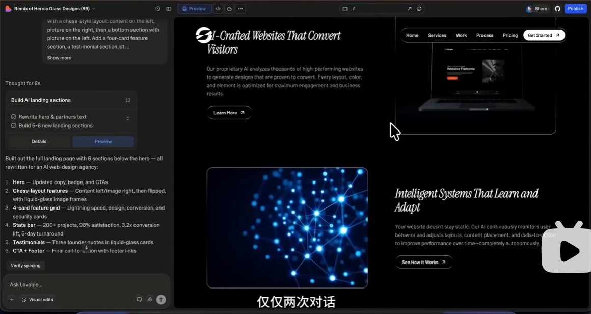

到这一步页面已经初具雏形了。不过很多图片和视频还是 AI 简单生成的占位图，后面需要通过同样的思路逐个替换。

---

## 六、素材替换 — 从 motionsites 源码中「借」资源

再次打开 motionsites 平台，去浏览别人 UI 设计的源码，找到他们使用的图片或视频链接，直接拆过来用。

然后回到 Lovable 交互对话，让它稍作改动后替换或插入这些素材。这一步同样需要**详尽的提示词**，重点强调「融合、不突兀」——换上去的素材要能和整体设计融为一体，不能有拼凑感。

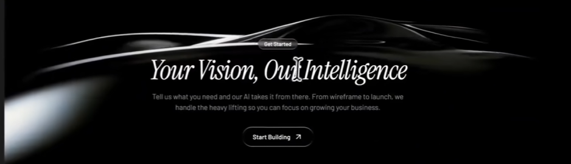

图片可以采用 GIF 格式插入，增加页面的动态感和表现力。

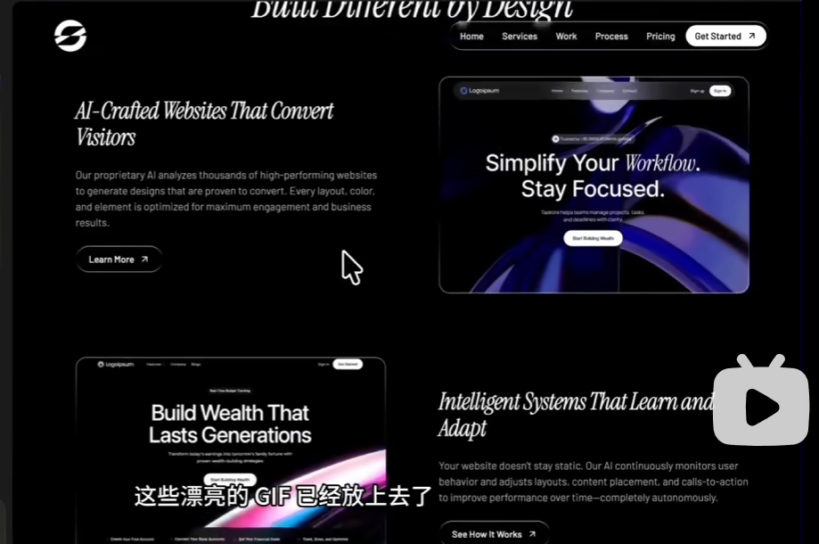

---

## 七、更多素材来源 — Design Rocket

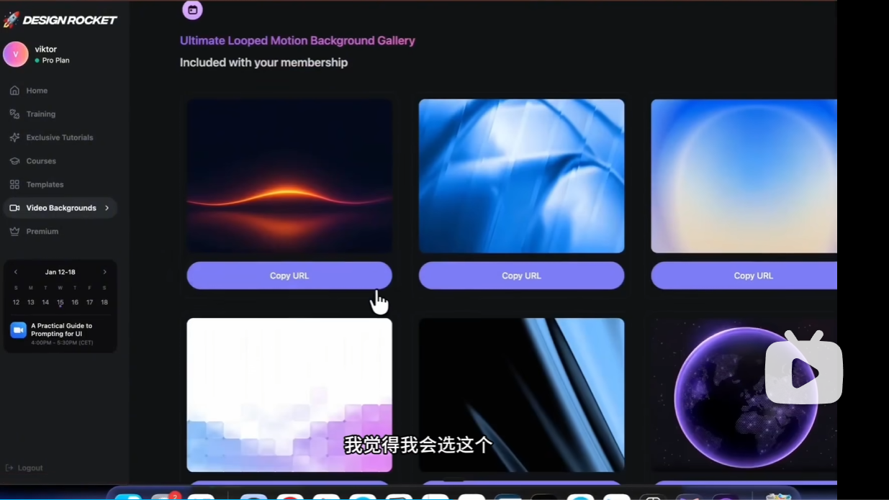

还可以去 Design Rocket 网站找更多的视频素材，扩充你的资源库。

---

## 八、文案与排版 — 苹果官网风格润色

最后一步，提升文案和排版质感。继续通过提示词让 AI 帮你打磨：

```
重写我们网页上的文字，确保采用苹果官网的风格，使用相同的短句，相同的高级感，直接模仿他们的排版和文案框架来为我们的网站撰写文案
```

目标是那种简洁、有呼吸感、读起来高级的文案风格——短句、大气、不啰嗦。
