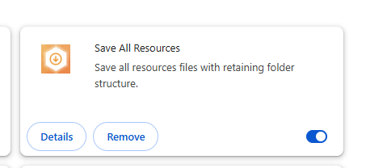
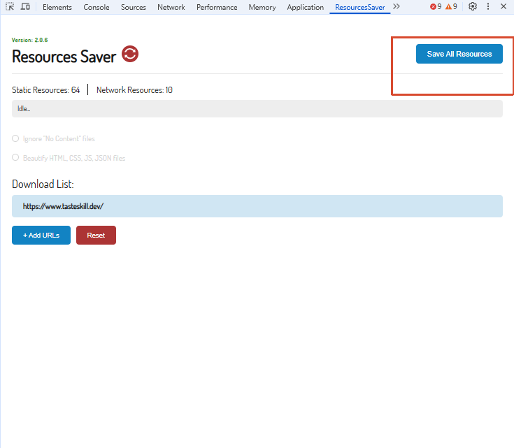
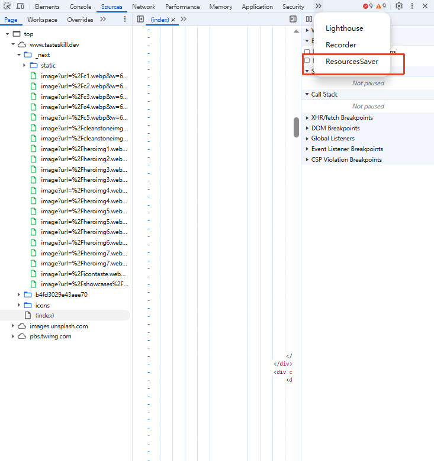

# 用 Save All Resources 扒网页资源

有时候需要把网页上的图片、CSS、字体等静态资源一次性全部扒下来——比如参考一个设计的落地页素材、或者收集某个页面的视觉资源做分析。Chrome 插件 **Save All Resources** 就是干这个的，操作非常简单。

## 一、安装插件

在谷歌浏览器商店搜索「Save All Resources」，直接安装即可。

插件地址：https://chromewebstore.google.com/detail/save-all-resources/abpdnfjocnmdomablahdcfnoggeeiedb

## 二、使用方法

1. 打开你要扒资源的目标页面
2. 按 `F12` 打开开发者工具（DevTools）
3. 在 DevTools 顶部标签栏找到并点击 **ResourceSaver** 标签页
4. 插件会自动扫描当前页面加载的所有资源，直接导出即可

全程两步：F12 → 点 ResourceSaver → 导出，不需要额外配置。
